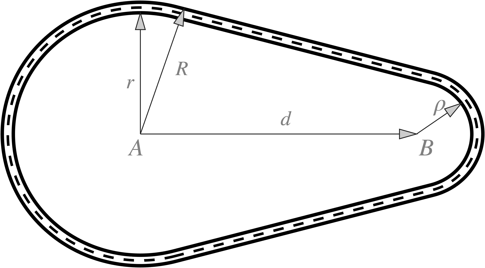

# Car Tracker Project

This is the repository for Team Alpha for Queen's University Belfast ELE8101 Control and Estimation theory module coursework 2 assignment.

**Team members:**

- Evan Calvert
- Conor Hamill
- Alastair Dempsey

## Project layout

```
project/
│
├── .gitignore
├── README.md
├── report			# All associated report documentation.
│
├── src				# Main project files.
│
├── testing-area	# Put all messy scripts/testing ideas here.
```

Note: src was not used. Too much effort to refactor.

## Project Requirements

The scripts will require installation of Casadi to run.

- [Casadi version: 3.7.2](https://web.casadi.org/get/)
- Arrow.m by Eric Johnson (MATLAB Add On)

Report requirements:

- LaTeX
- Strawberry Perl (Windows - required for latexmk)

## Problem statement

The objective of the assignment is to build a vehicle model and an estimator to follow a predetermined track geometry, and determine the velocity and the position of the vehicle relative to 3 fixed beacon locations around the track. The track geometry is as follows:



where:

- A: Circle 1 centre point [0, 0]
- B: Circle 2 centre point [100, 0]
- R: 50m
- r: 46m
- d: 100m
- $\rho$: 25m

## Estimators

Two estimators have been employed for the system, the Extended Kalman Filter, and a Bayesian estimator.

### Extended Kalman Filter

A Gaussian velocity model is used, demonstrating why a naïve model with a random walk in velocity is not appropriate for this style of problem.

The system model utilised for the trajectory is based on the Frenet frame of reference:

$\mathbf{s_{t+1}} = \mathbf{s_t} + v_{t}h + w_t$

where $\mathbf{x_t}$ is the full state space, $s$ is the arc position, $l$ is the lateral deviation from the centre line of the track, $v_s$ is the arc velocity, $v_l$ is the lateral velocity, and $w_t$ is a gaussian noise term, effectively acting as small deviations in acceleration. The output is defined as:

$\mathbf{y} = ||r_{x, y} - r_{x, y}^{(i)}||_2 + o_t$

where $\mathbf{y}$ is the output vector (Euclidean distance from each beacon), $r_{x, y}$ is the position of the vehicle on the track in cartesian co-ordinates, $r{x, y}^{(i)}$ is the position of each beacon measurement in cartesian co-ordinates and $o_t$ is a gaussian noise term. The state vector is:

$\mathbf{x_t} = \begin{bmatrix}s \\ l \\ v_s \\ v_l \end{bmatrix}$

Beacon placements as follows:

$r_{x,y} = \begin{bmatrix}-100 & -60 \\ 20 & 90 \\ 180 & -10 \end{bmatrix}$

An example of the trajectory of a vehicle with this trajectory is plotted below:

https://github.com/user-attachments/assets/06c5242d-76b0-45d6-bda2-75c305761a5e

### Bayesian Estimator
