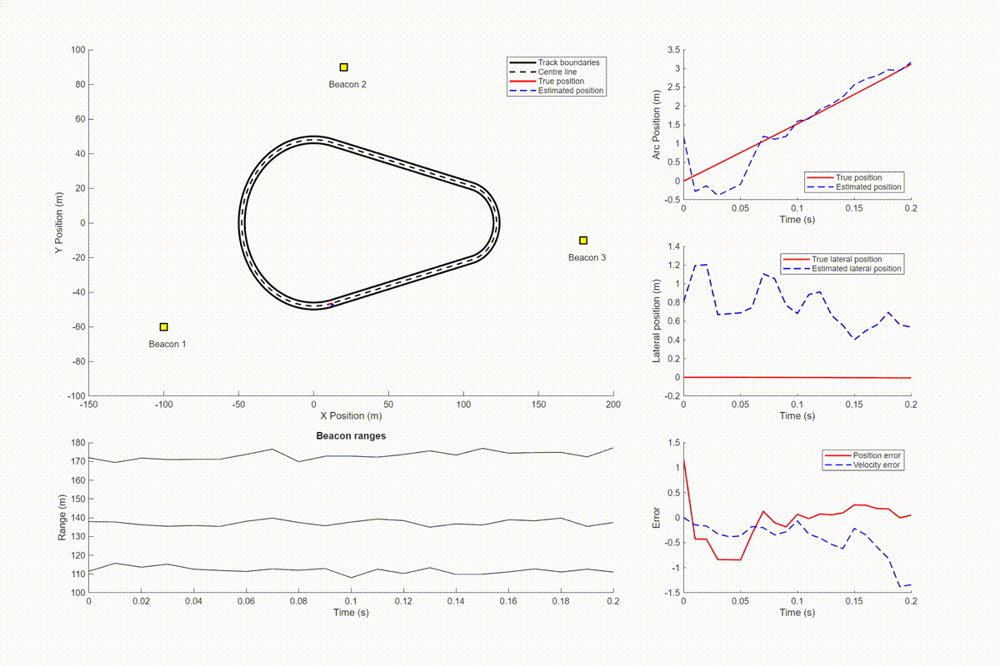

# Car Tracker Project

This is the repository for Team Alpha for Queen's University Belfast ELE8101 Control and Estimation theory module coursework 2 assignment.

**Team members:**

- Evan Calvert
- Conor Hamill
- Alastair Dempsey

## Project layout

```
project/
│
├── .gitignore
├── README.md
├── report			# All associated report documentation.
│
├── src				# Main project files.
│
├── testing-area	# Put all messy scripts/testing ideas here.
```

## Problem statement

The objective of the assignment is to build a vehicle model and an estimator to follow a predetermined track geometry, and determine the velocity and the position of the vehicle relative to 3 fixed beacon locations around the track.


where:

- A: Circle 1 centre point [0, 0]
- B: Circle 2 centre point [100, 0]
- R: 50m
- r: 46m
- d: 100m
- $\rho$: 25m

## Estimators

Two estimators have been employed for the system, the Extended Kalman Filter, and a Bayesian estimator.

### Extended Kalman Filter

A Gaussian velocity model is used, demonstrating why a naïve model with a random walk in velocity is not appropriate for this style of problem:

An example of the trajectory of a vehicle with this trajectory is plotted below: 



As expected, the estimator cannot enforce bounds on the state trajectories without violating assumptions of the EKF, and the state dynamics cause the trajectory of the vehicle to travel along the wall as the noise on the velocity term accumulates.

### Bayesian Estimator